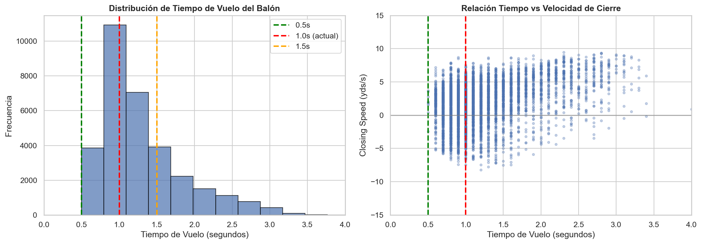
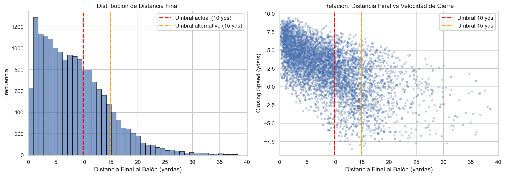
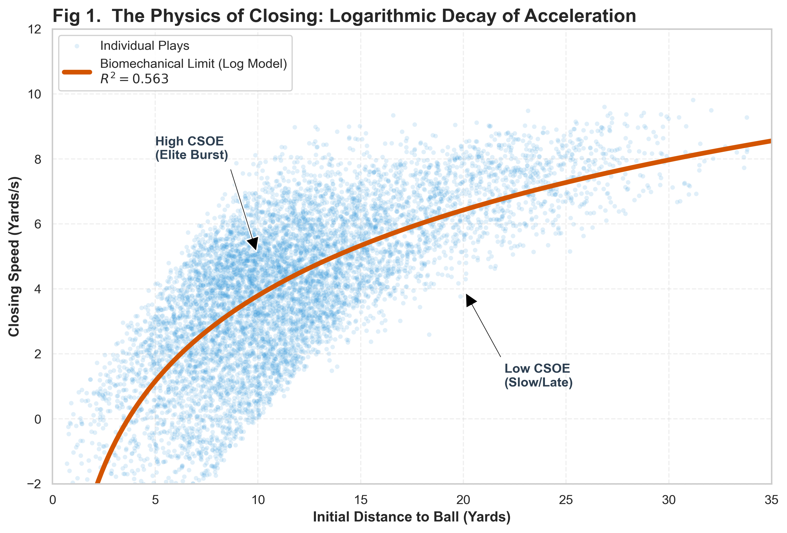
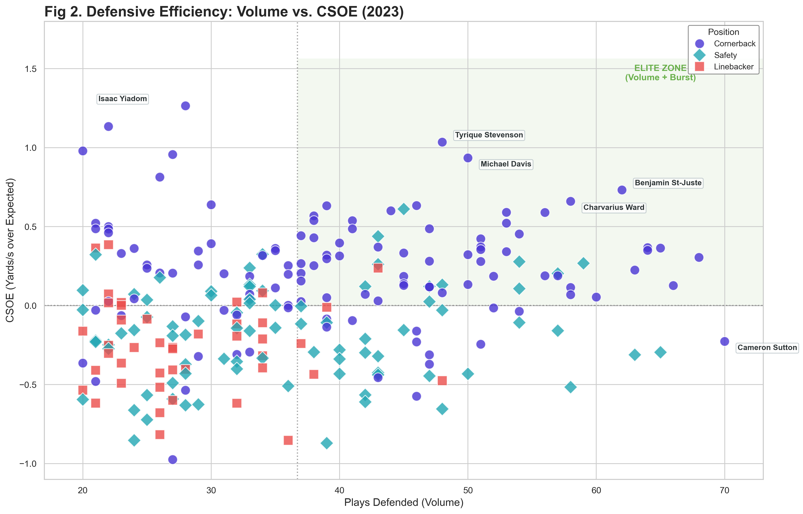
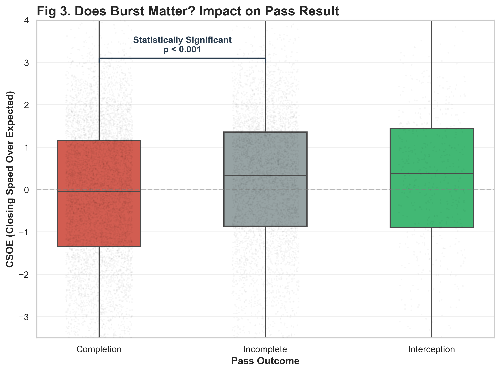
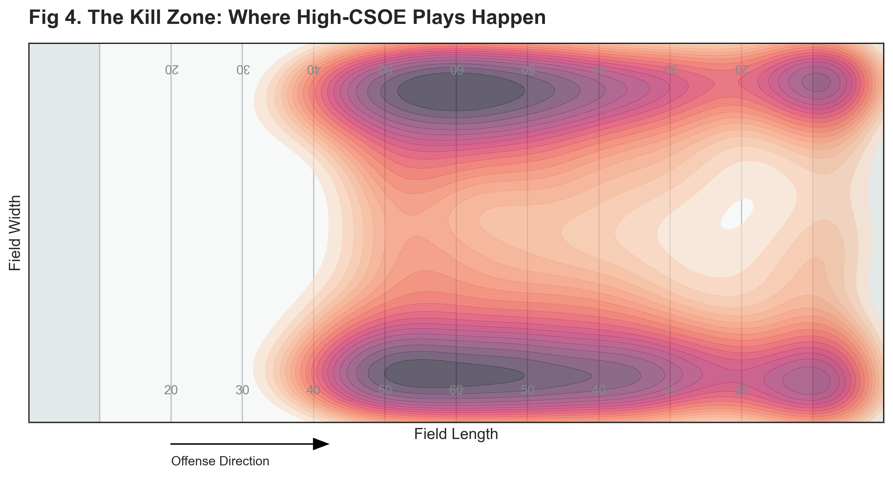
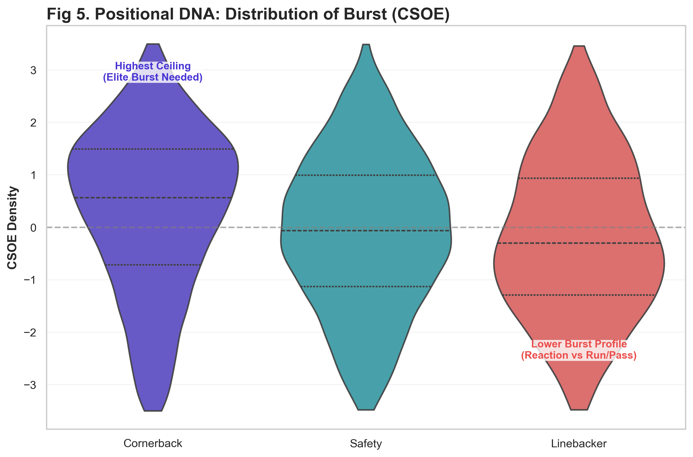
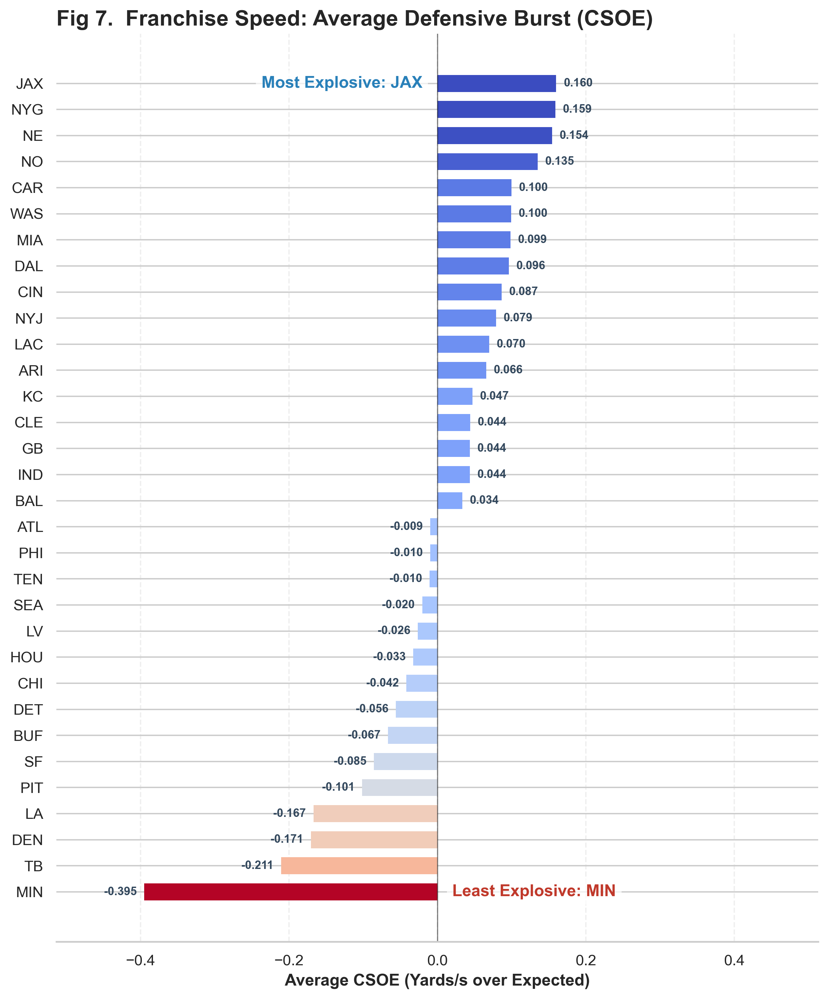
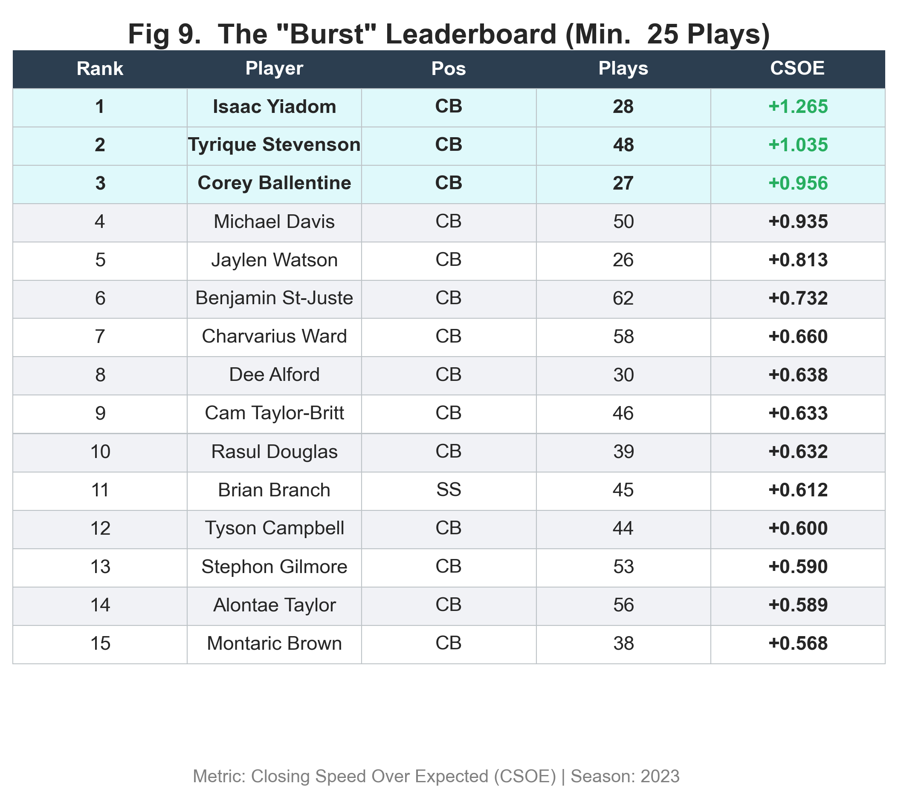

# Closing the Window: Quantifying Defensive Burst with CSOE

**NFL Big Data Bowl 2026 — Analytics Competition**

> *Speed lies, Burst wins.* This project introduces **CSOE (Closing Speed Over Expected)**, a novel metric that quantifies the defensive acceleration that erases separation and wins downs.

🔗 [Kaggle Writeup](https://www.kaggle.com/competitions/nfl-big-data-bowl-2026-analytics/writeups/closing-the-window-quantifying-defensive-burst-wi) · [Competition Page](https://www.kaggle.com/competitions/nfl-big-data-bowl-2026-analytics)

---

## The Problem

Traditional defensive metrics like top speed or distance covered fail to capture what truly separates elite defenders: **burst** — the ability to explosively close the gap on a receiver during ball flight. Two defenders may have identical top speeds, but the one who accelerates faster toward the ball in the critical 1–2 second window is the one who breaks up the pass.

## The Solution: CSOE

CSOE (Closing Speed Over Expected) isolates individual defensive effort from physical context by comparing a defender's actual closing speed against what is expected given their initial distance to the ball landing point.

The model works in three steps:

1. **Track** each defender's position at the moment of pass release and at ball arrival
2. **Fit** a logarithmic baseline: `Expected Speed = 3.80 × ln(Initial Distance) − 4.97` (R² = 0.56)
3. **Calculate** CSOE = Actual Closing Speed − Expected Closing Speed

A positive CSOE means the defender closed faster than expected — they demonstrated elite burst.

## Methodology

Two key thresholds were validated empirically before building the model:

- **Minimum ball flight time: 1.0s** — Shorter passes (screens, quick slants) don't provide enough tracking frames to measure acceleration. The 1.0s threshold maximizes sample size while ensuring mathematical stability.
- **Maximum final distance: 10 yards** — Only defenders actively contesting the catch are included. Beyond 10 yards, closing speed loses tactical meaning.




## Key Findings

| Finding | Detail |
|---|---|
| **20,680** defensive trajectories analyzed | Full 2023 NFL season (Weeks 1–18) |
| **R² = 0.563** | Initial distance explains 56% of closing speed variance |
| **p < 10⁻⁷⁷** | CSOE is statistically significant in predicting pass breakups vs completions |
| **Cornerbacks** show the highest CSOE ceiling | Safeties and linebackers have narrower distributions |
| **Fatigue effects** are measurable | CSOE degrades in late-game situations |

## Figures

### Fig 1. Biomechanical Model — Logarithmic Decay of Acceleration


### Fig 2. Elite Workhorses — Volume vs Burst


### Fig 3. Does Burst Matter? — Impact on Pass Result


### Fig 4. The Kill Zone — Where High-CSOE Plays Happen


### Fig 5. Positional DNA — Distribution of Burst by Position


### Fig 7. Team Ranking


### Fig 9. Player Leaderboard


## Animation

Example play showing a high-CSOE defensive close (Mike Ford, CSOE: +3.00):


## Tech Stack

- **Python** — pandas, NumPy, Matplotlib, Seaborn
- **Scikit-learn** — logarithmic regression model, R² evaluation
- **SciPy** — Welch's t-test for statistical significance
- **Matplotlib Animation** — frame-by-frame play reconstruction

## Data

NFL tracking data from the [NFL Big Data Bowl 2026](https://www.kaggle.com/competitions/nfl-big-data-bowl-2026-analytics) competition on Kaggle. The dataset contains player positions sampled at 10 Hz for every play of the 2023 NFL season.

Due to competition rules, raw data is not included in this repository. To reproduce the analysis, download the data from Kaggle and place it in a `data/train/` directory.

## How to Run

```bash
# Clone the repository
git clone https://github.com/JorgeAcin/nfl-closing-speed-csoe.git
cd nfl-closing-speed-csoe

# Install dependencies
pip install -r requirements.txt

# Open the notebook
jupyter notebook notebooks/csoe_analysis.ipynb
```

## Repository Structure

```
├── notebooks/
│   └── csoe_analysis.ipynb    # Full analysis pipeline
├── figures/                   # Generated visualizations (9 figures + threshold analysis)
├── media/                     # Play animation
├── requirements.txt           # Python dependencies
└── README.md
```

## Author

**Jorge Acín Zurita** — Data Science Student, Universitat Politècnica de València (UPV)

[](https://linkedin.com/in/jorgeacin)
[](https://github.com/JorgeAcin)
